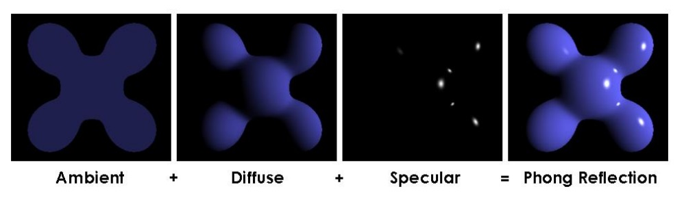

# Трассировка лучей
## Постановка
В пространстве есть некая точка обзора (камера, глаз). Также в пространстве
присутствует некая трёхмёрная конструкция (сцена). Между ними
располагается прямоугольник, поделённый на квадратные пиксели (экран).
Задача трассировки лучей заключается в том, чтобы из точки обзора
провести луч через центр каждого пикселя экрана – и понять, пересекает ли
он какой-либо из объектов сцены. Если луч ничего не пересекает, тогда
соответствующий пиксель экрана нужно закрасить белым цветом. Если луч
пересекает какой-либо из объектов, требуется закрасить пиксель нужным
цветом, отличным от белого. В самом простом варианте этой задачи пиксель
закрашивается чёрным цветом, независимо от того, какой из объектов сцены
он пересекает и в какой точке.

  

## Объекты на сцене
Существует множество видов трёхмерных геометрических фигур. В нашей
задаче мы ограничимся тремя видами:
 шар (задаётся координатами центра и радиусом);
 бокс – прямоугольный параллелепипед, грани которого параллельны
координатным плоскостям (задаётся координатами двух своих вершин:
той, у которой все три координаты минимальны, и той, у которой все
три координаты максимальны);
 тетраэдр (задаётся координатами четырёх своих вершин).
Самая главная математика в этой задаче будет зашита в функции,
определяющей: пересекается луч с фигурой или нет
## Цвета раскраски
Закрашиваем пиксели разными цветами, в
зависимости от того, какой объект пересекает луч. Учитываем освещенность и глянцевость.
Для описания освещённости матовых и
глянцевых поверхностей рекомендуется использовать модель Фонга.

  

## Сохранение изображения
Программа написана на С++. Это дает возможность распараллеливать на
OpenMP.
Когда всем пикселям экрана задан цвет – его сохраняем в виде BMPизображения. Для этого используется CImg.h.
## Входные данные
1) координаты камеры x, y, z (три вещественных числа);
2) координаты вектора нормали к экрану (три вещественных числа);
3) координаты вектора, перпендикулярного нормали к экрану, задающего
направление «вверх» (три вещественных числа);
4) расстояние от камеры до экрана a0 (одно вещественное число);
5) расстояние от камеры до границы видимости a0+ a1 (одно вещественное
число);
6) угол обзора по вертикали α (одно вещественное число);
7) ширина w и высота h экрана в пикселях (два целых числа);
8) координаты источника света (три вещественных числа) – опционально.

  

На рисунке зелёным цветом показана область видимости. Обрабатываются
только те объекты, которые лежат в этой области.
cam 0.0 0.0 0.0
normal 0.0 0.0 1.0
up 0.0 1.0 0.0
screen 2.0
limit 20.0
alpha 30.0
width 640
height 480
light 2.0 2.0 0.0

Кроме того, нужно задавать тип и параметры геометрических фигур –
объектов на сцене.
sphere 0.0 0.0 0.0 1.0
box 0.0 0.0 0.0 1.0 1.0 1.0
tetra 0.0 0.0 0.0 1.0 0.0 0.0 0.0 1.0 0.0 0.0 0.0 1.0

Если задавать ещё и цвет фигур, тогда это будет
выглядеть так:
sphere 0.0 0.0 0.0 1.0 255 255 0
box 0.0 0.0 0.0 1.0 1.0 1.0 255 0 255
tetra 0.0 0.0 0.0 1.0 0.0 0.0 0.0 1.0 0.0 0.0 0.0 1.0 255 0 0
## Условия
Перспективная проекция, произвольное количество любых фигур. На
экране фигуры отображаются различными оттенками серого цвета, в
зависимости от объёма. Фигуре самого большого объёма соответствует
цвет (64, 64, 64), фигуре самого маленького объёма – цвет (191, 191,
191). Промежуточным фигурам присваивается нечто среднее по
принципу: чем меньше фигура – тем она светлее. Необходим учёт
освещения, все поверхности – глянцевые.

## Инструкция по запуску:
1) Скопировать репозиторий
2) Заполните файлы data_f1, data_s1
3) Запустите программу файлом main

## Один из полученных результатов:

  

